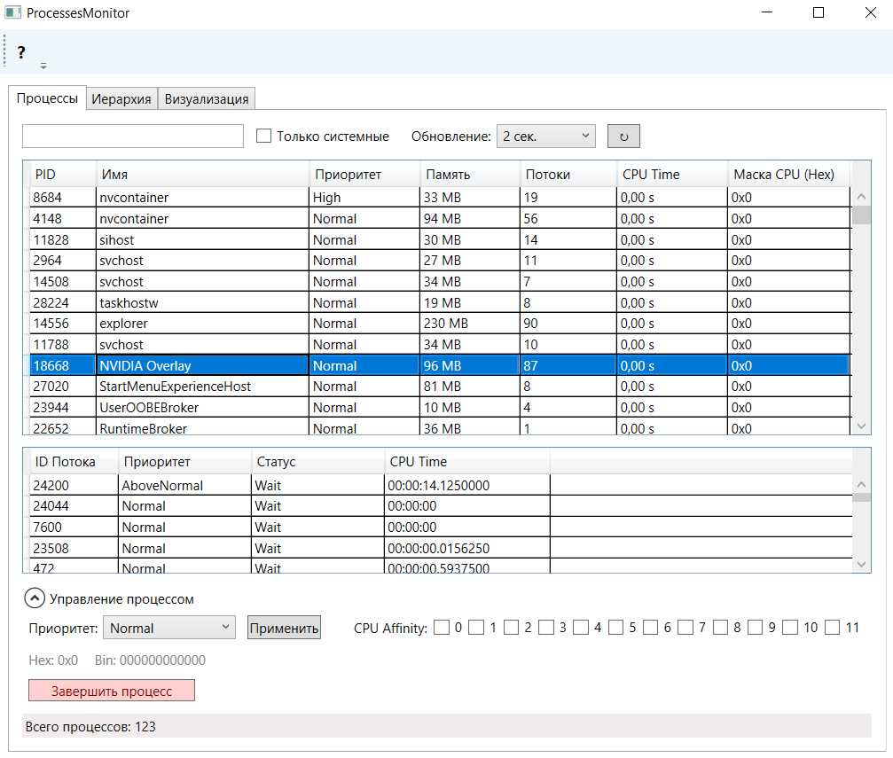
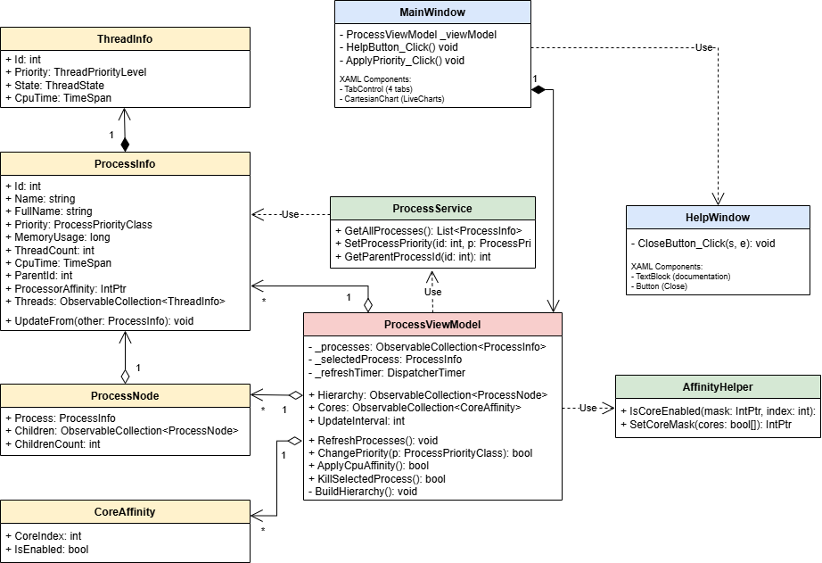

# ProcessesMonitor

**ProcessesMonitor** — это высокофункциональное WPF-приложение на базе .NET, предназначенное для глубокого мониторинга и управления системными процессами Windows в реальном времени. Приложение построено с использованием паттерна **MVVM**, что обеспечивает четкое разделение логики и интерфейса.

## Основные возможности

### Мониторинг процессов

* **Обновляемый список:** Отображение всех активных процессов с данными о PID, использовании памяти, количестве потоков и времени CPU.
* **Управление потоками:** Детальная таблица потоков для каждого выбранного процесса (ID, статус, приоритет).
* **Иерархия:** Визуализация процессов в виде дерева «Родитель-Потомок» с подсчетом дочерних элементов.
* **Динамическое обновление:** Настройка интервала обновления данных (2, 5 или 10 секунд).

### Управление и контроль

* **CPU Affinity:** Редактирование маски сходства ядер процессора через удобный интерфейс чекбоксов.
* **Приоритеты:** Изменение класса приоритета процесса (от Idle до Realtime).
* **Завершение:** Возможность принудительной остановки процесса прямо из интерфейса.
* **Фильтрация:** Быстрый поиск по имени и выделение системных служб.

### Визуализация

* **Memory Chart:** Круговая диаграмма распределения оперативной памяти между Топ-10 наиболее ресурсоемкими процессами.
* **Индикация:** Цветовая подстветка процессов с высоким и критическим (Realtime) приоритетом.

---
## Структура проекта

---

## Требования к системе

- **ОС**: Windows 10/11 (64 bit)
- **.NET**: от .NET 6.0
- **Диск**: свободное пространство от 1.5 МБ.
- **Пакет SDK:** v8.0.403
- **Версия языка** v10.0